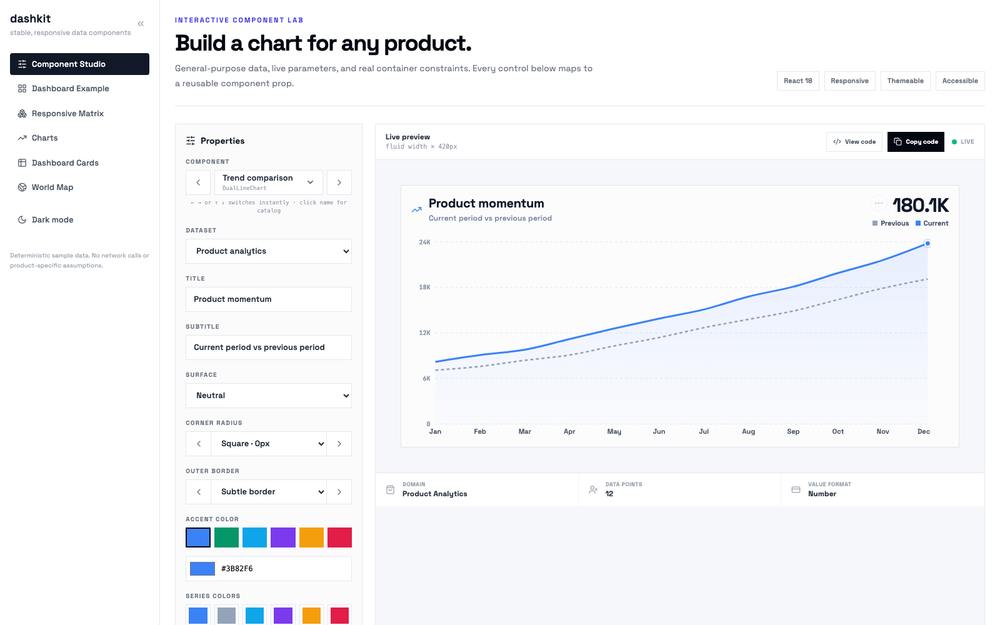
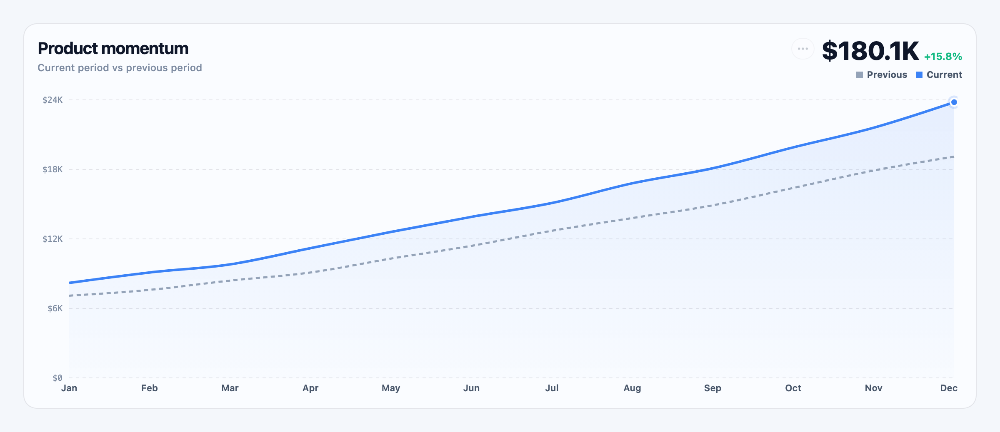
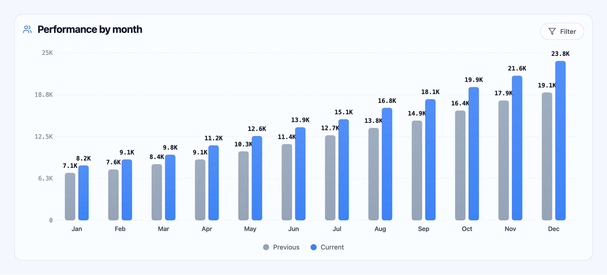
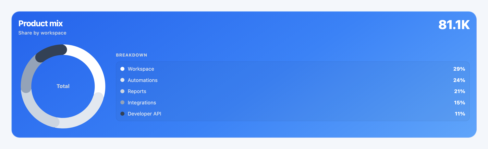

# Dashkit

Production-ready React analytics components for dashboards, internal tools, and agent-generated interfaces.

[](https://react.dev/)
[](#responsive-by-contract)
[](#theming)
[](#agent-and-mcp-support)
[](LICENSE)

Dashkit is a general-purpose component library with 38 charts, data cards, ranked views, and geographic visualizations. Every component follows a shared visual contract, accepts deterministic data, and is designed to remain readable across mobile, tablet, desktop, square, portrait, and wide containers.

**[Open the live component studio](https://shaafsalman.github.io/dashkit/)**



## Why Dashkit

- **Stable chart chrome:** titles stay top-left, primary values stay top-right, and the visualization owns the space between them.
- **Responsive by contract:** components fill their parent while preserving readable type, labels, axes, and aspect-ratio variants.
- **Editable visual system:** configure data, labels, accent colors, six-color series palettes, surface, radius, border, and container size.
- **Consistent number formatting:** large values use compact `K`, `M`, and `B` notation across values, labels, and axes.
- **Neutral and brand surfaces:** neutral cards use a balanced multicolor palette; brand cards use high-contrast white-to-slate data ink.
- **Accessible interaction:** semantic controls, keyboard chart/container navigation, visible focus states, and non-color value labels.
- **Copy-ready code:** the Component Studio generates a reusable React example for the current configuration.
- **Agent-ready:** the included MCP server exposes the component catalog, design rules, JSX generation, and config validation.

## Visual system

| Standard trend | Responsive grouped bars |
|---|---|
|  |  |

### Brand surface

Brand surfaces keep the selected accent in the background and use white-to-slate data colors for reliable contrast.



## Install

Dashkit currently ships directly from this repository.

```bash
npm install git+https://github.com/shaafsalman/dashkit.git
```

React and React DOM are peer dependencies:

```bash
npm install react@^18 react-dom@^18
```

The repository declares the chart engines used by individual components (`recharts`, Chart.js, and ECharts), plus `lucide-react` and `react-simple-maps`.

## Quick start

```jsx
import { DualLineChart } from "dashkit";

const labels = ["Jan", "Feb", "Mar", "Apr", "May", "Jun"];
const previous = [7100, 7600, 8400, 9100, 10300, 11400];
const current = [8200, 9100, 9800, 11200, 12600, 13900];

const theme = {
  base: "light",
  accent: "#3B82F6",
  series: ["#3B82F6", "#94A3B8", "#0EA5E9", "#7C3AED", "#F59E0B", "#E11D48"],
  radius: 16,
  frame: { border: "rgba(15, 23, 42, 0.10)" },
};

export function ProductMomentum() {
  return (
    <div style={{ width: "100%", aspectRatio: "16 / 9" }}>
      <DualLineChart
        title="Product momentum"
        subtitle="Current period vs previous period"
        total={13900}
        changePct={12.4}
        labels={labels}
        before={{ label: "Previous", color: theme.series[1], values: previous }}
        after={{ label: "Current", color: theme.series[0], values: current }}
        theme={theme}
        size="fill"
      />
    </div>
  );
}
```

Formatting helpers are exported when you need the same notation outside a chart:

```jsx
import { compactNumber, compactCurrency } from "dashkit";

compactNumber(23800);      // "23.8K"
compactCurrency(26700000); // "$26.7M"
```

## Component catalog

| Category | Components |
|---|---|
| Change over time | `DualLineChart`, `ComparisonChart`, `AreaTrendChart`, `StackedBarChart`, `RibbonStackChart`, `EarningsBarChart`, `WaterfallChart`, `TrendBarcodeCard`, `WeekdayBars`, `TargetBarcodeChart` |
| Ranking and distribution | `BarRankingChart`, `RadarChart`, `HeatmapGrid`, `ResponseRatePanels`, `ActivityCalendar`, `RankedList`, `ProgressTrackList`, `MetricsTable` |
| Composition | `DonutChart`, `FunnelChart`, `RadialBarsChart`, `CompositionBar`, `RadialBladeChart` |
| Progress and health | `ProgressGauge`, `GaugeCard`, `SpeedometerChart`, `BarcodeMeterCard`, `HexHealthChart`, `PercentGradientCard` |
| Summary and relationships | `StatTiles`, `BalanceStatsChart`, `NetworkGraphChart`, `KpiCard`, `GradientStatCard`, `FleetSnapshotCard`, `RankedLocationBoard`, `RankedDataWidget`, `WorldMap` |

The package entry point exports the complete chart, dashboard, geo, and widget libraries:

```jsx
import {
  DonutChart,
  FunnelChart,
  RankedDataWidget,
  ActivityCalendar,
  WorldMap,
} from "dashkit";
```

## Responsive by contract

Dashkit supports the following container presets in the Component Studio and generated examples:

| Preset | Ratio / behavior |
|---|---|
| Fluid | Fills the container with a 420px target height |
| Square | `1 / 1` |
| Portrait | `3 / 4` |
| Standard | `3 / 2` |
| Wide | `16 / 9` |
| Ultrawide | `2 / 1` |
| Custom | Editable width and height |

Axis-based charts share the same rules: reserved gutters, compact labels, stable grid treatment, readable minimum type size, and collision-aware label placement. Compact variants reduce detail before shrinking text into illegibility.

## Theming

Every chart resolves the same theme contract:

```jsx
const brandTheme = {
  base: "solid",
  accent: "#059669",
  series: ["#FFFFFF", "#E2E8F0", "#CBD5E1", "#94A3B8", "#64748B", "#334155"],
  radius: 20,
  frame: { border: "rgba(255, 255, 255, 0.28)" },
  solid: {
    surface: "linear-gradient(145deg, #047857 0%, #059669 55%, #34D399 100%)",
    border: "rgba(255, 255, 255, 0.28)",
    text: {
      primary: "#FFFFFF",
      secondary: "#E2E8F0",
      muted: "#CBD5E1",
    },
  },
};
```

The demo also includes electric blue, emerald, aqua, violet, amber, and rose presets. All six series colors remain editable, including on brand surfaces.

## Component Studio

The Studio is a live component workbench rather than a static gallery. It includes:

- categorized access to all 38 components;
- previous/next buttons and instant arrow-key navigation;
- dataset, title, subtitle, surface, radius, border, palette, and container controls;
- mobile, tablet, desktop, square, portrait, and wide previews;
- view-code and copy-code actions;
- deterministic sample data with no external network dependency;
- light and dark mode.

Run it locally:

```bash
git clone https://github.com/shaafsalman/dashkit.git
cd dashkit/demo
npm install
npm run dev
```

Create a production build:

```bash
cd demo
npm run build
```

## Agent and MCP support

The repository includes **Dashkit by NOOA**, a dependency-free stdio MCP server in [`plugins/dashkit/`](plugins/dashkit/README.md). It lets any MCP-capable coding agent:

- list the full component catalog;
- inspect a component and its stable layout contract;
- generate configured React/Dashkit JSX;
- retrieve global responsive, axis, formatting, and brand-surface rules;
- validate a proposed configuration before implementation.

Point an MCP client at the included server:

```json
{
  "mcpServers": {
    "dashkit": {
      "command": "python3",
      "args": ["/absolute/path/to/dashkit/plugins/dashkit/scripts/dashkit_mcp.py"]
    }
  }
}
```

The plugin uses an independent NOOA developer-tool identity with an NVIDIA-inspired electric-green accent. It is not affiliated with or endorsed by NVIDIA.

## Repository map

| Path | Purpose |
|---|---|
| [`src/lib/charts/`](src/lib/charts/README.md) | Shared chart system, chrome, themes, and formatting |
| [`src/lib/dashboard/`](src/lib/dashboard/README.md) | Dashboard cards, calendars, tables, and ranked views |
| [`src/lib/geo/`](src/lib/geo/README.md) | Geographic route visualization and helpers |
| [`src/widgets/`](src/widgets/README.md) | Multi-view ranked-data widget system |
| [`demo/`](demo/) | Component Studio, dashboard example, responsive matrix, and screenshot harness |
| [`plugins/dashkit/`](plugins/dashkit/README.md) | MCP plugin manifest and dependency-free server |
| [`docs/`](docs/) | Component documentation and README assets |

## Screenshot workflow

The README images are reproducible from the actual components:

```bash
cd demo
npx vite build --config vite.render.config.js
node capture.mjs screenshot-specs/trend.json ../docs/images/trend.png
node capture.mjs screenshot-specs/responsive-bars.json ../docs/images/responsive-bars.png
node capture.mjs screenshot-specs/brand-composition.json ../docs/images/brand-composition.png
```

No chart screenshot is a mockup; every image is rendered from the library code in this repository.

## License

Dashkit is available under the [MIT License](LICENSE).
